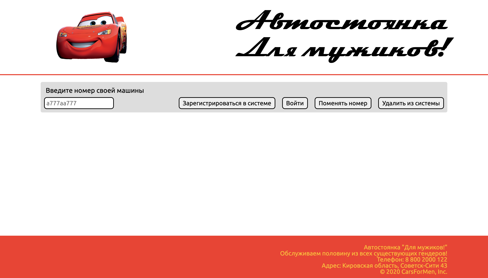
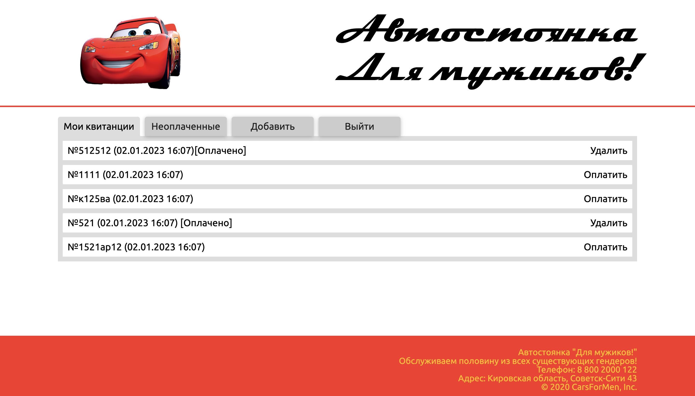
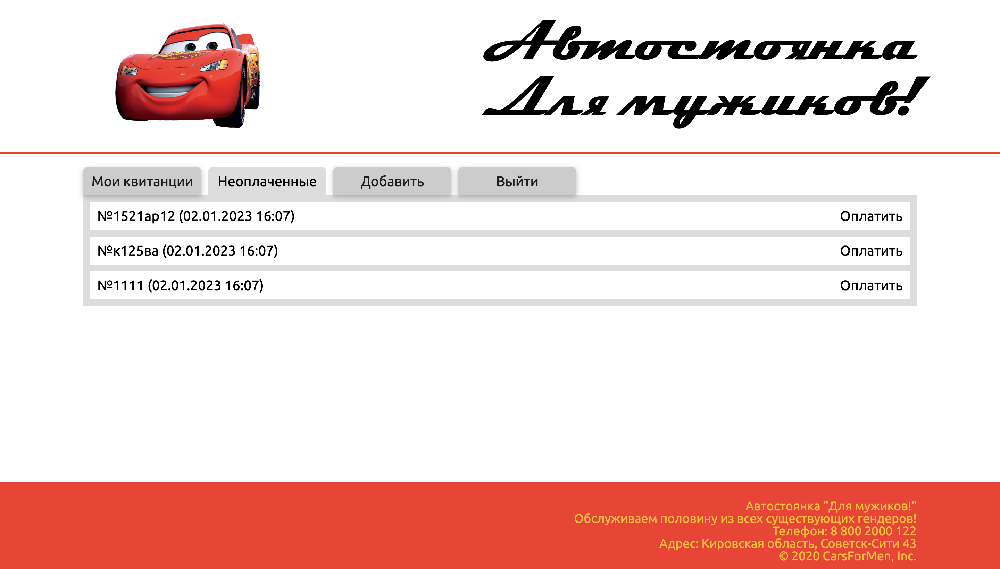
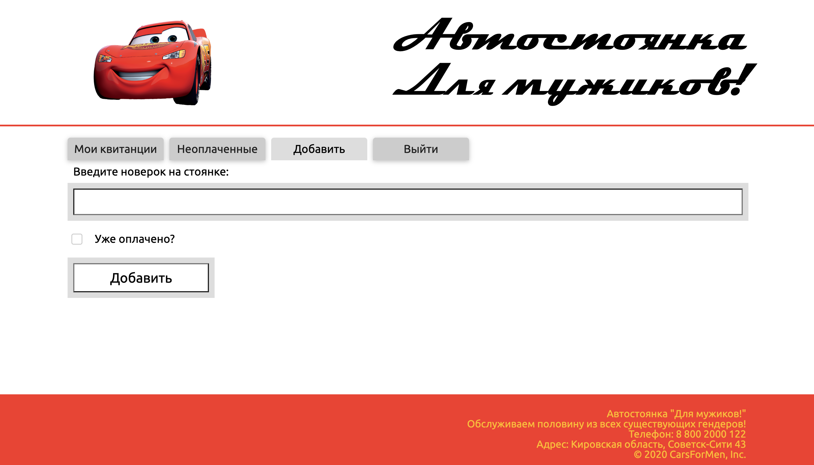

# Автостоянка для мужиков "Кчау"

Курсовая работа по Web-программированию

-   Выполнена в 2020
-   Отредактирована в феврале 2023

### Стэк

-   Backend: Node.js (Express), Mongoose
-   Frontend: jQuery

P.S. Описание работы с бэком приведено [в другом README-файле](./server/README.md)

---

## Страницы приложения

---

### Страница авторизации

### Страница всех квитанций

### Страница неоплаченных квитанций

### Страница добавления новой квитанции

